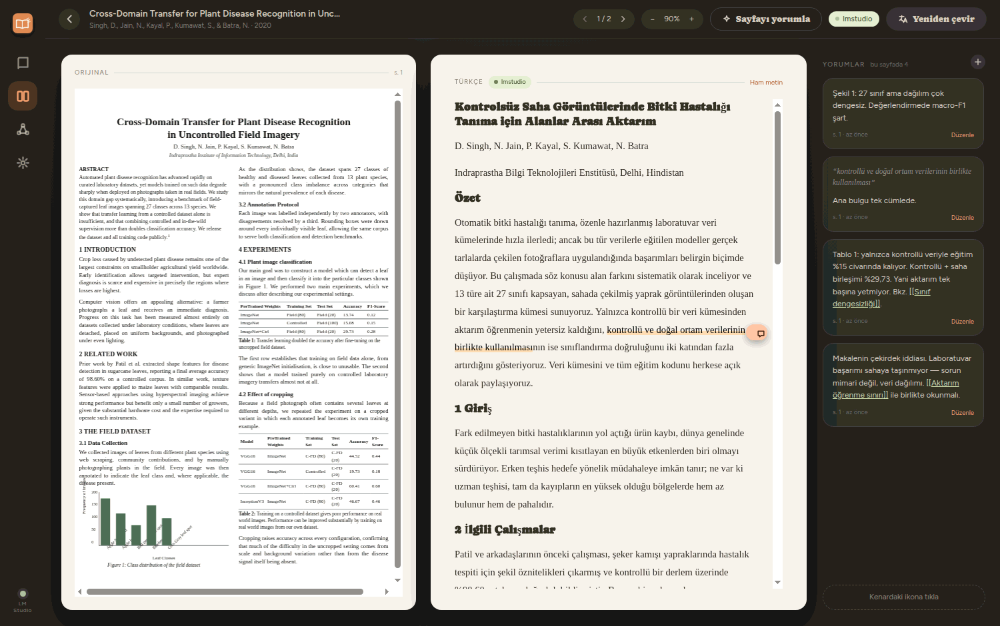
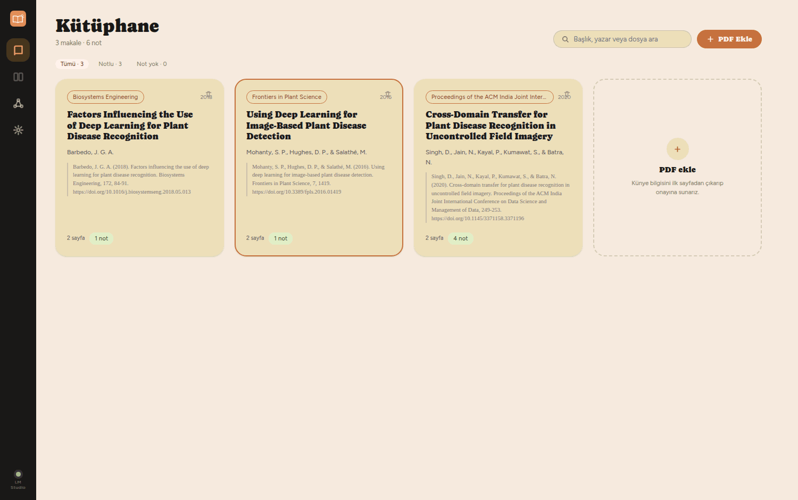
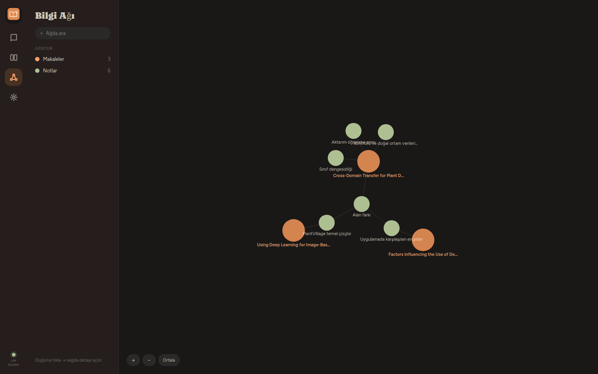
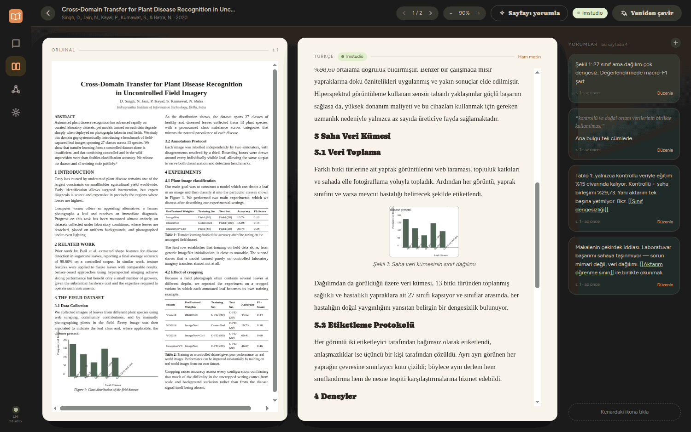
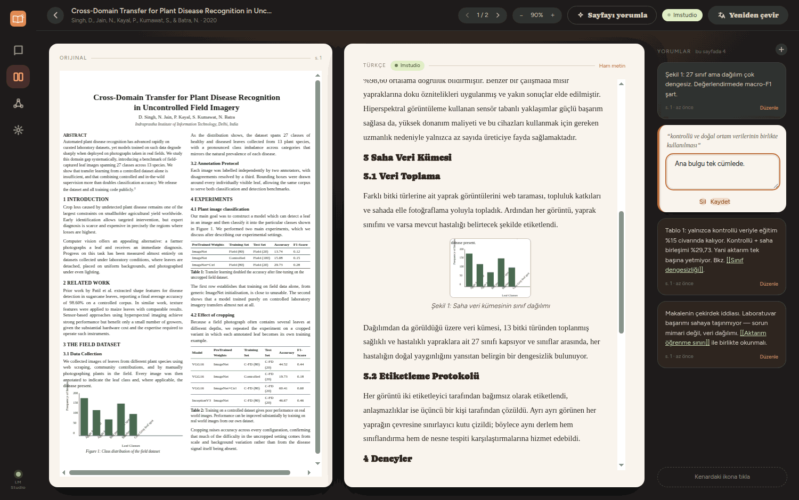

# fastread

**Read academic papers side by side — original on the left, translation on the right —
annotate as you go, and watch your notes grow into a linked knowledge graph.**

Translation runs on a **local LLM** through [LM Studio](https://lmstudio.ai), so the papers
you read never leave your machine. A cloud model (Gemini) is available as an optional
fallback, off by default.

🇹🇷 [Türkçe README](README.md) · The application interface is currently in Turkish.



---

## Why

Reading a paper in a second language means bouncing between tabs, and the notes you take
scatter across documents until you can no longer tell which idea came from which paper.
fastread keeps all three in one place: the source page, the translation, and the note —
each note permanently attached to the paper and page it came from.

## Features

**Side-by-side reading.** The original PDF page renders on the left, the translated page on
the right. Translation happens per page, streams in as it arrives, and is cached in a local
database — reopening a page never re-runs the model.

**Layout-aware translation.** The right-hand page is not a wall of text. fastread rebuilds
the page's structure from the PDF's own drawing operators and treats each part correctly:

| Element               | How it's handled                                                                                                                          |
| --------------------- | ----------------------------------------------------------------------------------------------------------------------------------------- |
| Headings & paragraphs | Detected and translated as separate blocks, in true reading order across columns                                                          |
| Tables                | Cropped from the page as an image — only the caption is translated, so cell values and numbers can't be mangled by the model              |
| Figures               | Same as tables: the image is preserved, the caption is translated                                                                         |
| Vector charts         | Bars plus rotated axis labels are recognised as one figure and cropped whole, instead of being torn into dozens of translatable fragments |
| Footnotes             | Rendered in footnote style; a footnote that is only a URL is shown as-is rather than being "translated" into nonsense                     |

**Notes and highlights.** Select any phrase in the translation and it is saved as a
highlight with a margin marker, Word-review style. Add a comment to it, or write a free note
on the page.

**Obsidian-style linking.** Write `[[Another note's title]]` inside a note and fastread
links the two. Those links, plus each note's parent paper, form the knowledge graph.

**APA metadata.** On import, the first page is sent to the model to draft the title, authors,
year, journal and DOI. You confirm or correct the draft, and an APA 7 citation is generated.

## Screenshots

| Library                                     | Knowledge graph                                   |
| ------------------------------------------- | ------------------------------------------------- |
|  |  |

| Figures & charts kept intact                                                                  | Margin notes                                                   |
| --------------------------------------------------------------------------------------------- | -------------------------------------------------------------- |
|  |  |

## Install

Requires [Node.js](https://nodejs.org) 20 or newer.

```bash
git clone https://github.com/<your-username>/fastread.git
cd fastread
npm install
npm run dev
```

On Windows you can skip the command line entirely — three double-clickable scripts are
included: `kur.bat` (install), `baslat.bat` (run), `exe-olustur.bat` (build an installer).

### Building a standalone app

```bash
npm run build:win     # Windows installer (NSIS) -> dist/
npm run build:mac     # macOS .dmg              -> dist/
npm run build:linux   # Linux AppImage          -> dist/
```

Each target must be built on its own platform. No native compilation is involved — the
database is [sql.js](https://sql.js.org) (SQLite compiled to WebAssembly), so `npm install`
needs no C++ toolchain.

## Setting up translation

### LM Studio (recommended, local)

1. Install [LM Studio](https://lmstudio.ai) and download a model. Any instruction-tuned
   model works; larger models produce noticeably better academic translation.
2. Open the **Local Server** (or **Developer**) tab and start the server.
3. In fastread's **Ayarlar** (Settings) page, confirm the address — usually
   `http://localhost:1234/v1` — and press **Bağlantıyı test et** to verify.

### Gemini (optional, cloud fallback)

Paste an [AI Studio](https://aistudio.google.com/) API key into Settings and set the engine
order. With the fallback enabled, page text is sent to Google's servers whenever the local
engine is unavailable — Settings says so explicitly next to the field.

## Where your data lives

Everything stays on your machine:

- `%APPDATA%/fastread/fastread.sqlite` — articles, notes, links, cached translations
  (`~/.config/fastread/` on Linux, `~/Library/Application Support/fastread/` on macOS)
- `%APPDATA%/fastread/settings.json` — engine settings and your API key, if you set one

PDFs are **not** copied into the library; only their path is stored. Moving or deleting a
PDF breaks the link, though the notes and metadata survive.

## Project structure

```
src/
  main/       Electron main process — SQLite (sql.js), LLM calls, IPC handlers
  preload/    contextBridge surface exposed to the renderer as window.api
  renderer/   React UI — Library / Reader / Graph / Settings
    lib/pdfLayout.ts   page-structure reconstruction (the heart of the reader)
  shared/     types + APA formatter used by both processes
docs/         design notes and screenshots
```

## Development

```bash
npm run dev        # run in development mode
npm run typecheck  # TypeScript, both tsconfigs
npm run lint       # ESLint
npm run format     # Prettier
npm run build      # typecheck + production build into out/
```

## Known limitations

- Metadata extraction depends entirely on the model. If it doesn't return valid JSON the
  form comes up blank and you fill it in yourself.
- Translation is page-by-page, so a sentence spanning a page break is translated in halves.
- Layout reconstruction is heuristic. It's tuned against two-column papers with ruled
  tables and captioned figures; unusual layouts may degrade to plain paragraphs.
- Graph node positions are recomputed on every visit — there is no saved layout.
- Only the Turkish UI is implemented, though the target language of the _translation_ is
  selectable in Settings.

## License

[MIT](LICENSE)

## Security

The reader treats every PDF as an untrusted document, because it is one. Text lifted out of
a PDF — and any translation of it — is sanitised with DOMPurify before it reaches the DOM,
the window is not permitted to navigate away from the app's own UI, the renderer runs
sandboxed with context isolation, and the preload exposes one narrow, purpose-built API
rather than a general IPC channel. `file:read` will only open a PDF already registered in
the library.

Your Gemini API key, if you set one, is stored in `settings.json` with owner-only
permissions and is sent as a request header to Google's endpoint and nowhere else.

If you find a security issue, please open an issue describing it (or email the address on
the repository owner's profile for anything you'd rather not disclose publicly).
